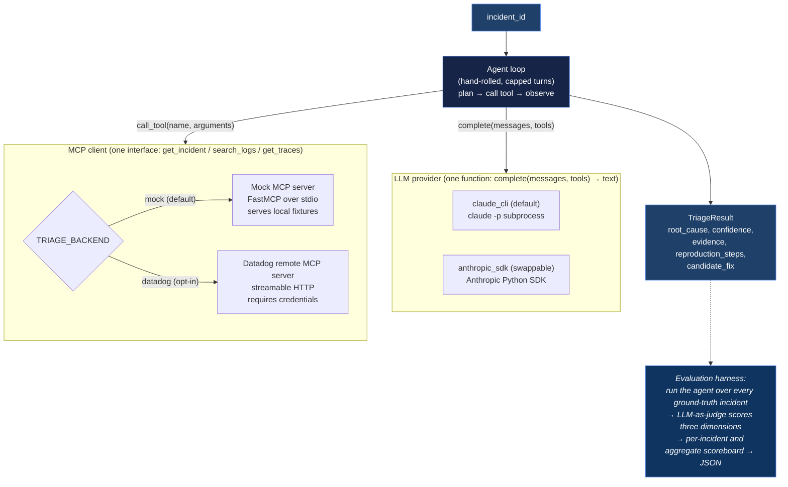
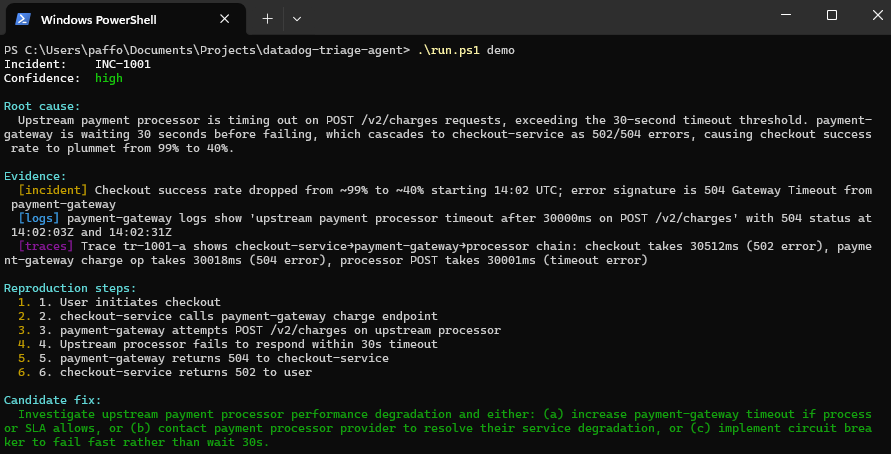
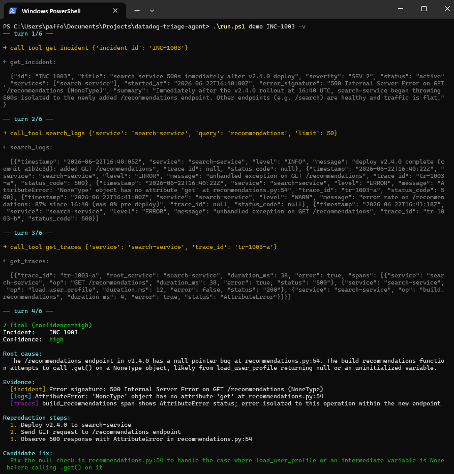
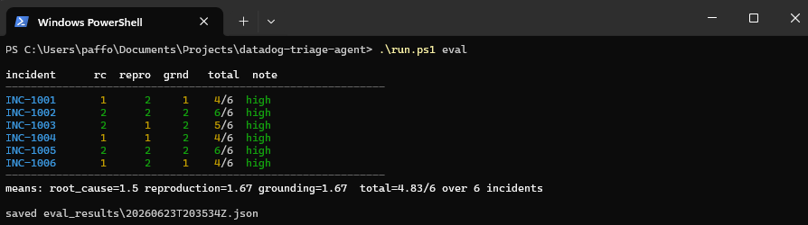

# datadog-triage-agent

A small, hand-rolled Python agent that takes a production incident signal, pulls
correlated observability context (incident details, logs, traces) through **MCP
tools**, reasons to a root-cause hypothesis, and emits a structured **"one-click
reproduce" recipe** plus a candidate fix. It ships with an **LLM-as-judge evaluation
harness** that scores triage quality against synthetic ground-truth incidents — so the
agent's quality is a measured number, not a vibe.

It runs **offline by default** — a local mock MCP server serves synthetic fixtures, so
there are no accounts or API keys to set up. The real Datadog remote MCP server is wired
in behind a flag (opt-in, documented below).

**No agent frameworks.** The loop is a plain capped turn loop over a one-function LLM
interface and a three-tool MCP surface — written out in
[`agent.py`](src/datadog_triage_agent/agent.py) so the reasoning is visible, not buried
in a library. The full design rationale lives in [`docs/DESIGN.md`](docs/DESIGN.md), and
the decision-by-decision log (with the gotchas I hit and how I solved them) in
[`docs/DECISIONS.md`](docs/DECISIONS.md).

## How it works



- The LLM is driven as a **pure text engine** behind a single function,
  `complete(messages, tools) -> str`. Tool calls travel as an **in-prompt JSON protocol**
  (the model replies with one `{"action": ...}` object), not native tool use — so the
  same loop works identically across providers and is trivial to test with a fake LLM.
- Both backends expose the **same three tools** (`get_incident`, `search_logs`,
  `get_traces`), so the agent code is backend-agnostic — only the client differs.
- The eval harness runs the agent over every ground-truth incident and has a *separate*
  judge model score three dimensions (root-cause correctness, reproduction actionability,
  evidence grounding). Ground truth lives only in the fixture files and is **stripped
  server-side** before the agent ever sees an incident — the agent can't cheat.

## Walkthrough

The `demo` and `eval` output is color-coded in a terminal — evidence sources, confidence,
and judge scores each get their own color — and degrades to clean plain text when piped or
redirected. The sample blocks below show the same content without color.

### 1. Triage a single incident — `.\run.ps1 demo`

The agent investigates INC-1001 end-to-end and prints a populated `TriageResult`. It
correctly separates the *failing* service (checkout) from the *upstream cause*
(payment-gateway's saturated connection pool to its processor), and grounds every claim
in a log line or span it actually retrieved.



<details><summary>Sample output (text)</summary>

```txt
Incident:    INC-1001
Confidence:  high

Root cause:
  payment-gateway connection pool to upstream payment processor saturated at 64/64
  connections, causing request queuing and 30-second timeouts on charge operations

Evidence:
  [logs] 2026-06-23T14:01:50Z WARN: connection pool to payment processor saturated
         (active=64/64), queuing requests
  [logs] 2026-06-23T14:02:03Z ERROR: upstream payment processor timeout after 30000ms
         on POST /v2/charges (trace tr-1001-a)
  [traces] trace tr-1001-a shows payment-gateway POST processor /v2/charges span timing
           out at 30001ms, causing 504 response to checkout-service
  [incident] checkout success rate dropped from 99% to 40% at 14:02 UTC, matching pool
             saturation timestamp

Reproduction steps:
  1. Generate sustained checkout traffic causing >64 concurrent charge requests
  2. Observe payment-gateway connection pool exhaustion warning
  3. Requests queue and timeout after 30 seconds
  4. checkout-service receives 504 responses and fails

Candidate fix:
  Increase payment-gateway connection pool size beyond 64, or tune pooling (raise max
  connections, reduce idle timeout, add connection recycling) to absorb the traffic spike
```

</details>

### 2. Watch the agent reason — `.\run.ps1 demo INC-1003 -v`

The verbosity flag streams the hand-rolled loop's inner workings to stderr: each tool
call, its arguments, and the observation that came back — so you can see the agent plan,
gather evidence, and converge, rather than treating it as a black box.



### 3. Score every incident — `.\run.ps1 eval`

The eval harness runs the agent over all six incidents and has a separate judge model
grade each result against the private ground truth. The judge is discriminating — it
penalizes confident-but-unsupported answers rather than rewarding fluency.



<details><summary>Sample output (text)</summary>

```txt
incident      rc  repro  grnd   total  note
------------------------------------------------------------
INC-1001       1      1     2    4/6  high
INC-1002       2      1     2    5/6  high
INC-1003       2      1     2    5/6  high
INC-1004       2      2     2    6/6  high
INC-1005       2      2     2    6/6  high
INC-1006       1      2     2    5/6  high
------------------------------------------------------------
means: root_cause=1.67 reproduction=1.5 grounding=2.0  total=5.17/6 over 6 incidents
```

Scores vary run-to-run (the CLI provider has no temperature control). `rc` = root cause,
`repro` = reproduction, `grnd` = grounding; each dimension is 0–2.

</details>

## Prerequisites

| To run...                          | You need                                                              |
| ---------------------------------- | -------------------------------------------------------------------- |
| `demo` and `eval` (live)           | Python ≥ 3.10, [`uv`](https://docs.astral.sh/uv/), **and the `claude` CLI** (logged in via Claude Code). |
| `test` / `lint` / `typecheck`      | Python ≥ 3.10 and `uv` only — these run fully **offline**.            |

The default LLM provider shells out to `claude -p`, which authenticates through your
existing Claude Code login (no API key). **Without the `claude` CLI installed and logged
in, the `demo` and `eval` commands cannot run** — there is no other built-in provider
that works key-free. (An Anthropic SDK provider is implemented as a swappable
alternative, but it needs an `ANTHROPIC_API_KEY`; see below.) The test suite is designed
to run with no `claude` CLI present.

## Quickstart (offline, no accounts)

```powershell
uv sync                 # create the venv, install deps
.\run.ps1 demo          # full triage on INC-1001, pretty-printed
.\run.ps1 eval          # run all 6 incidents, print a scoreboard, save eval_results/latest.json
.\run.ps1 test          # offline test suite (no `claude` needed)
.\run.ps1 lint          # ruff
.\run.ps1 typecheck     # mypy --strict
```

`run.ps1` is a thin Windows-first task runner; each task is just
`uv run python -m datadog_triage_agent.<module>`, which works on any platform.

`.\run.ps1 demo INC-1003` triages a different fixture. The six synthetic incidents
(`fixtures/incidents/INC-100{1..6}.json`) cover a payment-gateway timeout cascade, DB
connection-pool exhaustion, a bad-deploy `NoneType`, an OOMKilled memory leak, an expired
upstream credential, and a 429 retry-storm — each with correlated logs and traces that
actually point to the root cause.

## Seeing what the agent did (trace mode)

Both `demo` and `eval` take a verbosity flag — `-v`, `-vv`, `-vvv` (or `--verbose`, or
`TRIAGE_TRACE=1..3`) — that streams the loop's inner workings to **stderr**. The final
result / scoreboard stays on stdout, so `… -vv 1>out.txt` still captures a clean result.

| Level  | Adds                                                                                |
| ------ | ----------------------------------------------------------------------------------- |
| `-v`   | each tool call + arguments + the observation it returned; turn headers; eval scores |
| `-vv`  | + every turn's raw LLM reply (the model's reasoning + chosen action); judge payload  |
| `-vvv` | + raw LLM transport (`claude -p` argv & stdout / Anthropic request & response)        |

It's plain stdlib `logging` on a `triage.*` logger tree, so third-party libraries stay
quiet at every level.

## Configuration

All knobs are environment variables (see [`.env.example`](.env.example); a `.env` file is
loaded if present). Defaults run the offline mock path.

| Variable             | Default  | Meaning                                            |
| -------------------- | -------- | -------------------------------------------------- |
| `TRIAGE_BACKEND`     | `mock`   | `mock` \| `datadog`                                |
| `TRIAGE_LLM`         | `cli`    | `cli` (`claude -p`) \| `anthropic` (SDK)           |
| `TRIAGE_MODEL`       | `haiku`  | agent model (`haiku`/`sonnet`/`opus` or a full id) |
| `TRIAGE_JUDGE_MODEL` | `sonnet` | eval judge model                                   |
| `TRIAGE_MAX_TURNS`   | `6`      | agent tool-budget per incident                     |

## Swappable LLM provider: the Anthropic SDK

The default provider is the `claude -p` CLI because a Claude Code login authenticates it
out of the box but does *not* include an Anthropic API key. The Anthropic SDK provider is
implemented behind the same one-function interface as a documented alternative (it needs
API credits):

```powershell
uv sync --extra anthropic       # install the `anthropic` package
$env:ANTHROPIC_API_KEY = "sk-ant-..."
$env:TRIAGE_LLM = "anthropic"
.\run.ps1 demo
```

It renders the tool catalog into the system prompt and uses the same in-prompt JSON
protocol, so the agent loop is byte-for-byte identical to the CLI path.

## Real Datadog backend (opt-in, not exercised here)

Setting `TRIAGE_BACKEND=datadog` points the same three-tool surface at Datadog's remote
MCP server over streamable HTTP, mapping our tool names onto Datadog's
(`search_datadog_logs`, `search_datadog_spans`/`get_datadog_trace`,
`get_datadog_incident`):

```powershell
$env:TRIAGE_BACKEND = "datadog"
$env:DATADOG_MCP_URL = "https://mcp.datadoghq.com/..."   # per your Datadog site
$env:DD_API_KEY = "..."
$env:DD_APPLICATION_KEY = "..."
.\run.ps1 demo
```

This path is **written and typed but not validated** — it was developed without a Datadog
account, so the exact auth scheme (OAuth vs API-key headers), the remote tools' argument
names, and the response normalization back into our schema are marked
`TODO(datadog-creds)` in
[`datadog.py`](src/datadog_triage_agent/mcp_backends/datadog.py). Treat it as a documented
integration point, not a tested feature.

## Design notes

A few of the decisions behind the code — the full set, with the gotchas and how I worked
through them, is in [`docs/DECISIONS.md`](docs/DECISIONS.md):

- **Hand-rolled loop, no framework.** The whole agent is one readable, testable
  [`triage()`](src/datadog_triage_agent/agent.py) function with explicit recovery for
  malformed replies, bad tool calls, and schema-invalid finals. The point of the project
  is to *show* the loop, not hide it.
- **One-function LLM seam.** `complete(messages, tools) -> str` is the entire LLM
  interface. The CLI and SDK providers are interchangeable; the loop and tests never know
  which is behind it.
- **In-prompt JSON tool protocol.** Chosen over native tool use so a text-only engine
  (`claude -p`) can drive the loop and so the parser is testable with a scripted fake LLM.
- **Eval integrity by construction.** `ground_truth` is stripped *server-side* in
  `get_incident` and pinned by a test, so the agent structurally cannot see the answers
  it's being graded against.
- **Driving `claude -p` as a deterministic text engine.** A lean flag set
  (`--tools ""  --strict-mcp-config  --setting-sources ""  --no-session-persistence`) was
  needed to stop it loading the working directory's MCP servers/hooks and hanging — one of
  several non-obvious findings logged in `docs/DECISIONS.md`.
- **Typed and strict.** `mypy --strict` clean across all source files; `ruff` clean; the
  test suite runs offline without the `claude` CLI.

## Limitations / next steps

- **The Datadog backend is unverified** (no account) — see the TODOs above.
- **The CLI provider is not deterministic.** `claude -p` exposes no temperature control,
  so eval scores vary run-to-run. The judge is discriminating (it catches, e.g., the agent
  embellishing a retrieved detail into an unsupported claim), but treat the scoreboard as
  directional.
- **No prompt tuning.** The agent prompt is deliberately plain; raising eval scores by
  tightening "don't embellish beyond retrieved evidence" is left as a separate effort.
- The final `TriageResult` is not streamed token-by-token; for step-by-step visibility into
  the loop, use the `-v`/`-vv`/`-vvv` trace flag (above).

## Project layout

```txt
src/datadog_triage_agent/
  agent.py            # the hand-rolled async triage loop
  prompts.py          # system prompt + in-prompt JSON tool protocol
  models.py           # pydantic types (TriageResult, Incident, LogEntry, ...)
  config.py           # Settings.from_env() — single env-read point
  console.py          # ANSI color for demo / eval / trace, TTY-gated (stdlib only)
  demo.py             # end-to-end triage on one incident
  llm/                # complete(messages, tools): claude_cli (default) | anthropic_sdk
  mcp_backends/       # TriageMCPClient (mock) | DatadogMCPClient (remote)
  mock_server/        # FastMCP stdio server; serves fixtures; strips ground_truth
  evals/              # harness + judge + rubric
fixtures/             # 6 synthetic incidents with correlated logs/traces + ground truth
tests/                # offline; run without the `claude` CLI
docs/                 # DESIGN.md (architecture) + DECISIONS.md (decision log)
```
