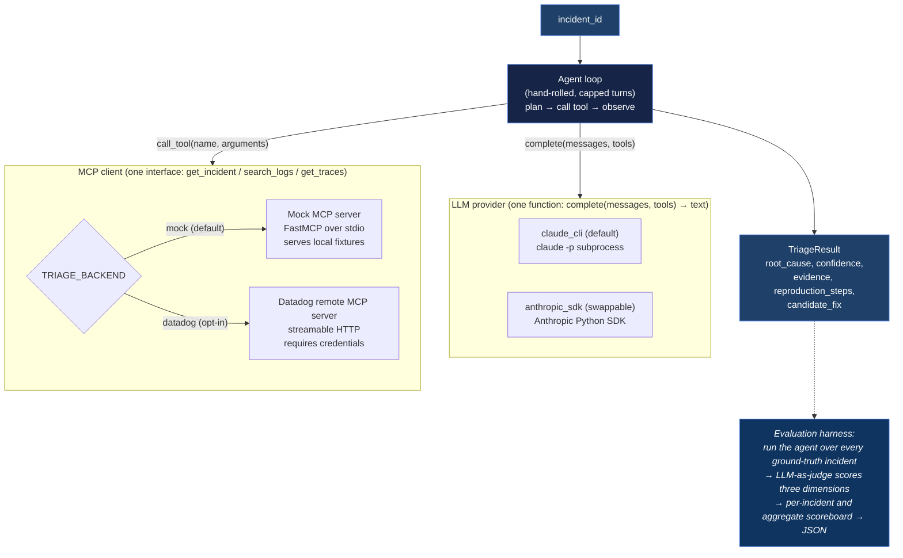

# Design — datadog-triage-agent

The design doc for this project: the problem, the constraints I set for myself, the
architecture, and the component-by-component reasoning. Read alongside
[`DECISIONS.md`](DECISIONS.md), which logs the concrete decisions and the external
facts (API shapes, flag spellings, gotchas) discovered while building it.

## Problem & goal

When a production incident fires, an on-call engineer does the same loop every time:
pull the incident, read the logs, follow the traces, separate the service that is
*failing* from the upstream cause of the failure, and write up a root cause with a way
to reproduce it. That loop is mechanical enough to be a good fit for a small,
well-instrumented agent — and valuable enough that getting it right matters.

The goal here is a hand-rolled agent that takes an incident signal, pulls correlated
observability context (incident details, logs, traces) through **MCP tools**, reasons
to a root-cause hypothesis, and emits a structured, evidence-grounded **"one-click
reproduce" recipe** plus a candidate fix. It ships with an **LLM-as-judge evaluation
harness** that scores triage quality against synthetic ground-truth incidents, so the
agent's quality is a measured number, not a vibe.

## Design principles (the constraints I set)

These are self-imposed. They're the interesting part — anyone can wire a framework
together; the constraints are where the engineering judgement shows.

1. **No agent frameworks.** No LangChain / LlamaIndex / CrewAI. The agent loop is a
   plain, capped turn loop written out in [`agent.py`](../src/datadog_triage_agent/agent.py)
   so the reasoning is *visible*, testable, and debuggable — not buried in a library.
2. **The LLM is one function.** `complete(messages, tools) -> str`. Everything
   provider-specific lives behind that single seam. Swapping `claude -p` for the
   Anthropic SDK changes one module and nothing else.
3. **One tool surface, two backends.** The same three tools (`get_incident`,
   `search_logs`, `get_traces`) are served by a local mock *and* by Datadog's remote
   MCP server. The agent code is byte-for-byte identical regardless of backend.
4. **Offline by default.** The whole thing runs with no accounts and no API keys: a
   local mock MCP server serves synthetic fixtures. The real Datadog path is opt-in.
5. **Evaluable.** A triage agent you can't score is a demo. The eval harness runs the
   agent over every incident and has a *separate* judge model grade three dimensions.
6. **Minimal, typed, small.** Stdlib over dependencies. `mypy --strict`, `ruff`, and a
   test suite that runs without the `claude` CLI installed.

## Architecture

## Components

### LLM layer (`llm/`)

- `base.py` — `LLMClient` Protocol: `complete(messages, tools) -> str`. Returns the
  assistant **text**; the agent parses tool calls out of it. Keeping the interface a
  single text function (rather than a native tool-use schema) is what makes it trivial
  to swap providers and to fake in tests.
- `claude_cli.py` (default) — drives the `claude -p` CLI as a pure text engine
  (`--tools ""`, plus a lean flag set so it doesn't load the cwd's MCP servers/hooks
  and hang). Serializes the transcript, renders the tool catalog into the system
  prompt, parses the JSON `result`. Authenticates via the local Claude Code login, so
  it works with no API key.
- `anthropic_sdk.py` (swappable) — same contract via the `anthropic` package, imported
  lazily so the base install needs no extra. Maps bare model aliases (`haiku`/`sonnet`/
  `opus`) to full IDs. Selected with `TRIAGE_LLM=anthropic`.

### Agent loop (`agent.py`)

`async def triage(incident_id, mcp, llm, max_turns) -> TriageResult`. Each turn:
`llm.complete()` → parse one JSON action → dispatch.

- **Tool call** → `mcp.<tool>(**args)` → feed the JSON observation back as the next
  user message.
- **Final** → validate against the `TriageResult` schema (pydantic). Valid → return.
  Invalid → ask for a corrected object.
- **Unparseable** → a corrective nudge; counts against the turn budget.
- Every tool exception is caught and fed back to the model as an observation, so the
  agent can read the error and recover next turn instead of crashing the run.
- On budget exhaustion: one forced synthesis call ("you're out of budget, answer now").

The loop is async only so the MCP `ClientSession` can stay open across turns; the LLM
call itself is synchronous (the session is idle during it, so blocking briefly is fine —
no thread executor needed).

### Tool-use protocol: in-prompt JSON, not native tool use

The model replies with exactly one JSON object per turn — either
`{"action": "call_tool", "tool": ..., "arguments": {...}}` or
`{"action": "final", "result": {<TriageResult fields>}}`. This keeps the LLM interface a
single text function (so it's identical across providers and a `claude -p` text engine
can drive it), and makes the loop's parser trivially testable with a scripted fake LLM.
The cost — occasional malformed-JSON retries — is absorbed by the loop's nudge path.

### MCP backends (`mcp_backends/`)

- `client.py` — `TriageMCPClient`, an async context manager (`AsyncExitStack` over
  `stdio_client` + `ClientSession`) that launches the mock server as a stdio subprocess
  and exposes the three tools as awaitable methods.
- `datadog.py` — `DatadogMCPClient`, the same surface over Datadog's remote MCP server
  (streamable HTTP), mapping our three tool names onto Datadog's. Written and typed but
  **not exercised** (no account) — every spot needing a live server to confirm is marked
  `TODO(datadog-creds)`.

### Mock server (`mock_server/server.py`)

`FastMCP` over stdio, exposing `search_logs` / `get_traces` / `get_incident`. It pools
every fixture file per kind and filters by query/service, mirroring how a real query API
behaves. **Critically, `get_incident` strips the private `ground_truth` field** before
returning — the agent must never see it, or the evaluation is meaningless. stdout is the
JSON-RPC channel, so all logs go to stderr.

### Tool schemas (tight, agent-friendly)

- `search_logs` → `LogEntry{timestamp, service, level, message, trace_id?, status_code?}`
- `get_traces` → `Trace{trace_id, root_service, duration_ms, error, spans[]{service, op, duration_ms, error, status}}`
- `get_incident` → `Incident{id, title, severity, status, services[], started_at, error_signature, summary}` (no `ground_truth`)

### Fixtures — correlated failure stories (6 incidents)

Each incident's logs **and** traces actually point to its root cause, and each carries a
private `ground_truth = {root_cause, key_evidence[], expected_fix_themes[]}` for the
judge. Distinct service names per incident keep the pooled mock from bleeding context
across cases.

1. **INC-1001** — payment-gateway upstream timeout → checkout 5xx cascade (the headline).
2. **INC-1002** — DB connection-pool exhaustion → latency spike → 503s.
3. **INC-1003** — bad deploy: unhandled `NoneType` on a new endpoint → 500s after release.
4. **INC-1004** — OOMKilled pods (memory leak) → restarts → intermittent errors.
5. **INC-1005** — expired upstream credential → 401/403 cascade.
6. **INC-1006** — third-party 429 + naive retries amplifying load → cascading failures.

### Evals (`evals/`)

- `harness.py` — `run_cases()` is the testable core (inject your own LLM/MCP); `main()`
  wires it from env. For each incident: run `triage()`, judge the result, collect scores,
  print a per-case + aggregate scoreboard, save JSON to `eval_results/`. One failing case
  records a zero-score row instead of sinking the whole run.
- `judge.py` + `rubric.py` — the judge gets the observable incident, the **ground truth**
  (read straight from the fixture, never through the MCP surface), and the agent's result,
  and scores three dimensions 0–2 each: *root cause correct? / reproduction actionable? /
  grounded in real evidence?* The rubric and full prompt live in `rubric.py` for easy
  inspection.

## Config & env

All knobs are environment variables (`Settings.from_env()` is the single env-read point;
`.env` is loaded if present). Defaults run the offline mock path. See
[`.env.example`](../.env.example) for the full list (TRIAGE_*, the opt-in DD_* Datadog
creds, and the opt-in ANTHROPIC_* SDK provider).

## Testing strategy

Every test runs **offline, without the `claude` CLI**. A scripted `FakeLLM` returns a
JSON sequence so the agent loop is exercised deterministically (tools fire, the result
validates, the turn cap holds, JSON/tool errors recover). `test_mock_backend.py` drives
the *real* mock server over stdio and pins the `ground_truth` redaction invariant.
`test_tool_parsing.py` covers the JSON extractor's edge cases.

## Verification (end-to-end)

1. `uv sync` (add `--extra anthropic` only to test the SDK provider).
2. **Demo:** `./run.ps1 demo` runs a full triage on INC-1001 and prints a populated
   `TriageResult` (root cause = payment-gateway upstream-timeout cascade).
3. **Evals:** `./run.ps1 eval` prints a per-case + aggregate scoreboard and writes
   `eval_results/latest.json`.
4. **Tests / lint / types:** `./run.ps1 test`, `./run.ps1 lint`, `./run.ps1 typecheck` —
   all green, tests run with no `claude` CLI present.

## Out of scope / explicit TODOs

- **Real Datadog auth + exact remote tool-name confirmation** — `TODO(datadog-creds)` in
  `datadog.py`. Written and typed, not validated against a live account.
- **No Docker, no web UI, no native tool-use protocol** — the in-prompt JSON protocol
  keeps the loop provider-agnostic; the determinism limits of the CLI are noted honestly
  in the README's limitations section.
